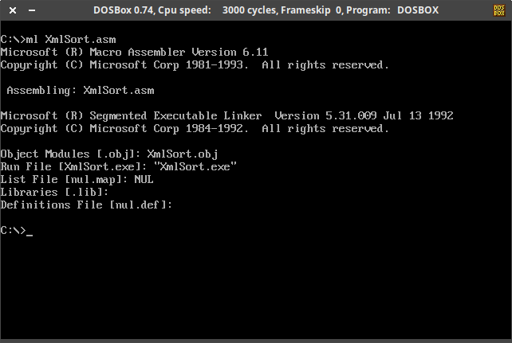

# XmlSort
Programa desarrollado en MASM16 para aplicar los métodos de ordenamiento "BubbleSort", "QuickSort" y "ShellSort" a un conjunto de números proporcionados en un archivo de entrada XML y mostrarlos en modo video en forma de gráfico de barras.
En el archivo [Entrada.xml](Entrada.xml) se encuentra un ejemplo de archivo de entrada con la sintaxis utilizada para la especificación de los números.

## :information_source:  Información General

Este programa fue realizado como parte del curso de **Arquitectura de Computadoras y Ensambladores 1** de la Universidad San Carlos de Guatemala. Los requerimientos utilizados para su elaboración pueden ser encontrados en el documento [Enunciado_Practica6.pdf](Enunciado_Practica6.pdf). Todo el **código de fuente** del programa se encuentra en el archivo [XmlSort.asm](XmlSort.asm).

### 📋 Pre-requisitos

Para la ejecución de este programa se utiliza el emulador [DOSBox](https://www.dosbox.com/) en su versión 0.74-3 y el ensamblador **MASM16** para la generación del ejecutable.

### 🛠️ Generación del ejecutable

Para la generación del ejecutable abrimos en **DOSBox** la ubicación donde se encuentra el código de fuente [XmlSort.asm](XmlSort.asm) e ingresamos el comando `ml xmlsort.asm`:

Después de realizado lo anterior, se nos generará el ejecutable **xmlsort.exe**.

### :diamonds: Uso del programa

Video con demostración del uso del programa:

Consultar [Enunciado_Practica6.pdf](Enunciado_Practica6.pdf) para ver todas las funcionalidades del programa y su uso.

### :books: Referencias

- **Instalación de DosBox y MASM en Windows 10:** https://youtu.be/pIRd79UsHXA?list=PLqRgrpHSnbblV_V42h-AFTioftYmi469H

- Libro recomendado: **Lenguaje Ensamblador para Computadoras Basadas en Intel - Quinta Edición - Kip. R. Irvine - ISBN: 978-970-26-1081-6**
